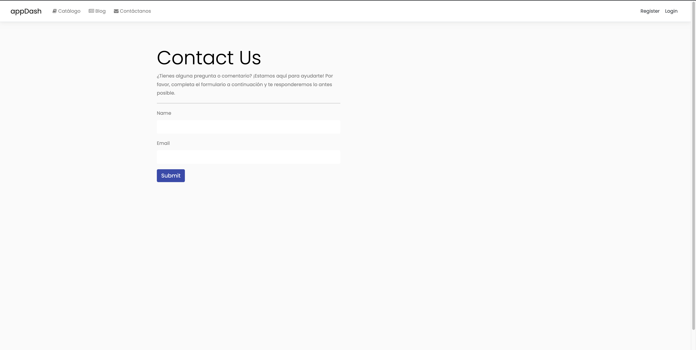
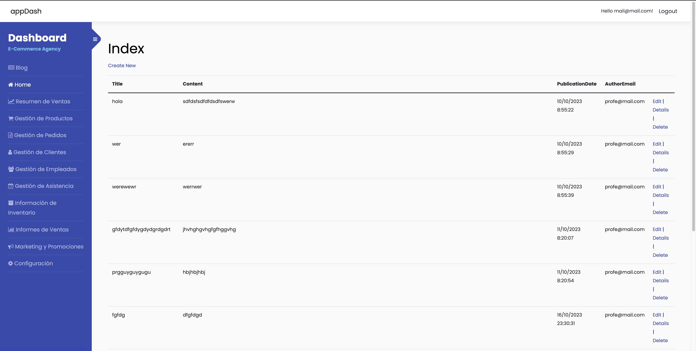

# appDash - E-Commerce Administration Panel Final Exam for Programming 5 in C#

Welcome to **appDash**, an administration panel developed in ASP.NET Core 7.0 to facilitate the complete management of your e-commerce. This README provides detailed information about the available modules and the technologies used in the project.

## Images of the Project

### 1. Login Page


### 2. Contact Page



### 3. Dashboard Page



## Core Technologies

- **ASP.NET Core 7.0**
  - **Description:** ASP.NET Core is an open-source, cross-platform framework for building modern and scalable applications on the .NET platform.
  - **Version Used:** 7.0

- **Entity Framework Core**
  - **Description:** Entity Framework Core is an object-relational mapper (ORM) that facilitates access and manipulation of data in .NET applications.
  - **Version Used:** 7.0

- **C#**
  - **Description:** C# is a modern, object-oriented programming language developed by Microsoft. It is widely used in the development of .NET applications.

## Database

- **SQLite and SQL Server**
  - **Description:** Both SQLite and SQL Server databases have been used to adapt to different needs and implementation environments.
  - **Versions Used:** 7.0.10 and 7.0.11 respectively

## Other Components

- **Microsoft.AspNetCore.Identity**
  - **Description:** A set of libraries for managing authentication and authorization in ASP.NET applications.

- **Microsoft.VisualStudio.Web.CodeGeneration.Design**
  - **Description:** Code generation tools for ASP.NET and .NET Core.

## Dependency Management

Project dependencies are managed using [NuGet](https://www.nuget.org/), the package management system for .NET.

## Administration Panel Modules

### 1. Blog
  - **Description:** This module allows complete management of blogs, including the creation, editing, and deletion of entries.
  - **CRUD Operations:**
    - Create a new blog entry.
    - Read and view existing entries.
    - Update the content of entries.
    - Delete unwanted entries.

### 2. Home
  - **Description:** This module provides a quick route to return to the main page of the administration panel.
  - **Operations:**
    - Easy navigation to the main page.

### 3. Sales Overview
  - **Description:** Visualize a detailed summary of sales made, providing key information about e-commerce performance.
  - **Operations:**
    - Viewing sales data.

### 4. Product Management
  - **Description:** Manage the product catalog, facilitating the addition, editing, and removal of products.
  - **CRUD Operations:**
    - Add new products to the catalog.
    - Edit details and attributes of existing products.
    - Remove products from inventory.

### 5. Order Management
  - **Description:** Efficiently manage orders placed by customers.
  - **CRUD Operations:**
    - Access to the list of orders.
    - Update the status of orders.
    - Delete unprocessed orders.

### 6. Customer Management
  - **Description:** Manage the customer base, allowing the creation, editing, and deletion of customer profiles.
  - **CRUD Operations:**
    - Creation of new customer profiles.
    - Editing customer information.
    - Deletion of customer profiles.

### 7. Employee Management
  - **Description:** Manage company personnel, facilitating the management of employee accounts and roles.
  - **CRUD Operations:**
    - Creation of employee accounts.
    - Assignment and update of roles.
    - Deletion of employee accounts.

### 8. Attendance Management
  - **Description:** Record and manage employee attendance for effective tracking.
  - **CRUD Operations:**
    - Daily attendance recording.
    - Updating attendance records.
    - Deletion of unnecessary records.

### 9. Inventory Information
  - **Description:** Access detailed information about inventory, providing a complete view of available products.
  - **Operations:**
    - Viewing inventory information.

### 10. Sales Reports
  - **Description:** Generate detailed sales reports for analysis and decision-making.
  - **Operations:**
    - Generation of sales reports.

### 11. Marketing and Promotions
  - **Description:** Manage marketing and promotional strategies to boost sales.
  - **CRUD Operations:**
    - Creation and management of marketing campaigns.
    - Modification of promotional strategies.
    - Deletion of obsolete campaigns.

### 12. Configuration
  - **Description:** Configure options and settings of the administration panel to suit specific needs.
  - **Operations:**
    - Custom configuration settings.

Each module has the necessary CRUD operations for complete information management, providing total control over key aspects of e-commerce. Explore and maximize the efficiency of **appDash** in managing your online store!

## How to Run the Code

To run the app, follow these steps:

1. Clone the repository:
   ```bash
   git clone https://github.com/abdielLopezpy/DashApp.git

    cd DashApp
    ``` 
2. Run the app:
   ```bash
   dotnet run
   ```


## Authors


**Abdiel López** - [LinkedIn](https://www.linkedin.com/in/alejandro-l-5b306a1a3/) - [GitHub](https://github.com/abdielLopezpy)
